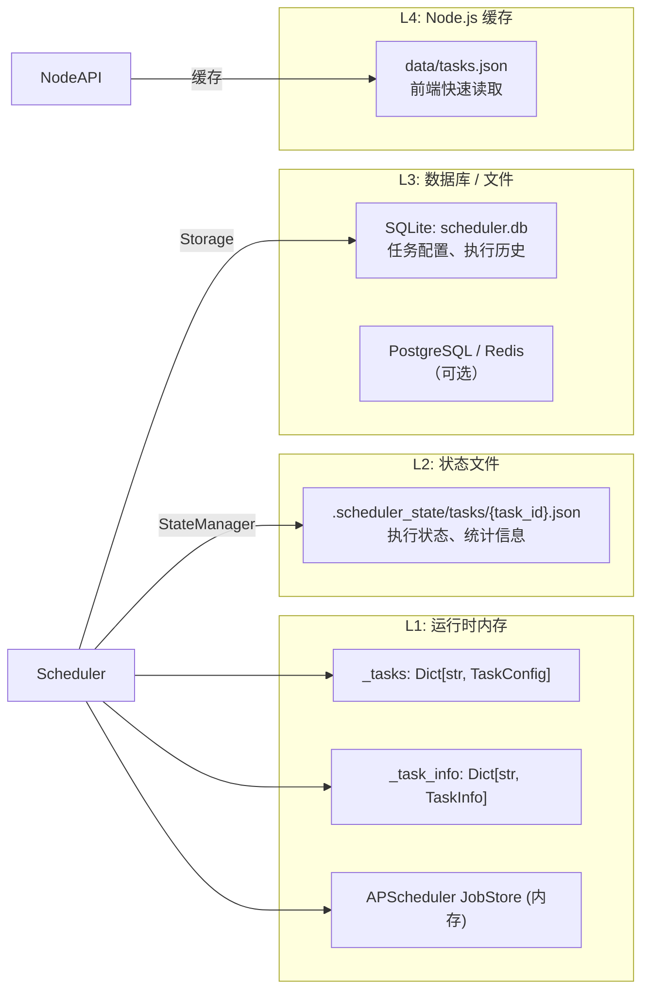
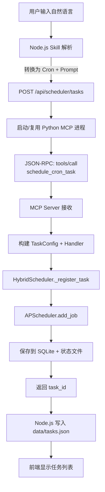

# AI Scheduler Skill - 项目说明文档

> **统一混合 AI 任务调度系统**  
> 支持 Cron 定时、Heartbeat 智能检查、Event 事件驱动三种调度模式，提供 MCP 工具、Python SDK、REST API 三种使用方式。

---

## 一、项目概述

### 1.1 项目定位

`ai-scheduler-skill` 是一个面向 AI Agent 生态的**定时任务调度技能组件**。它不仅仅是传统的 Cron 定时器，而是一个能够理解自然语言、调用大模型、执行联网搜索、推送实时通知的**智能任务调度引擎**。

### 1.2 核心能力

| 能力             | 说明                                                              |
| ---------------- | ----------------------------------------------------------------- |
| **三种调度模式** | Cron（精确时间）、Heartbeat（智能检查）、Event（Webhook 事件）    |
| **三种使用方式** | MCP 工具（Claude/Cursor）、Python SDK（装饰器）、REST API（HTTP） |
| **自然语言理解** | 支持中文时间描述自动转换为 Cron 表达式                            |
| **联网搜索增强** | 集成 Tavily API，新闻类任务自动获取最新资讯                       |
| **动态变量填充** | 支持 `{{date}}`、`{{weather}}`、`{{temperature}}` 等模板变量      |
| **多模型兼容**   | OpenAI、Anthropic、Ollama、DeepSeek 统一接入                      |
| **实时通知推送** | WebSocket 通知界面，任务执行结果自动弹窗                          |
| **多存储后端**   | SQLite（默认）、PostgreSQL、Redis、Memory                         |

### 1.3 项目仓库结构

```
D:/IT/AI智能体/ai-scheduler-skill/          # 文档与说明
D:/IT/新项目/ai-scheduler-skill/            # Python 核心引擎（主要代码）
D:/IT/AI智能体/my-chat-ui/                  # Node.js 集成层（前端 + API）
```

---

## 二、系统架构图

### 2.1 整体架构（分层视角）

┌─────────────────────────────────────────────────────────────────────────┐
│ 用户（浏览器 / Claude Desktop） │
└─────────────────────────────────┬───────────────────────────────────────┘
│ HTTP / stdio
▼
┌─────────────────────────────────────────────────────────────────────────┐
│ 前端交互层 │
│ ├─ React + TypeScript 聊天界面 │
│ └─ http://localhost:5173 │
└─────────────────────────────────┬───────────────────────────────────────┘
│ HTTP
▼
┌─────────────────────────────────────────────────────────────────────────┐
│ API 网关层 (Node.js) │
│ ├─ apps/agents/src/routes/scheduler.ts │
│ │ └─ HTTP API 路由 + MCP 客户端（进程管理/请求转发） │
│ └─ apps/agents/src/skills/scheduler/index.ts │
│ └─ 自然语言解析 Skill（中文时间 → Cron 表达式） │
└─────────────────────────────────┬───────────────────────────────────────┘
│ MCP stdio (JSON-RPC)
▼
┌─────────────────────────────────────────────────────────────────────────┐
│ 调度引擎层 (Python) │
│ ├─ mcp/server.py ── MCP Server（10 个工具） │
│ ├─ api/server.py ── FastAPI REST 接口 │
│ └─ core/scheduler.py ── HybridScheduler（三种模式统一调度） │
│ ├─ Cron Scheduler ── APScheduler 精确时间触发 │
│ ├─ Heartbeat Engine ── AsyncIO Loop 智能轮询 │
│ └─ Event Handler ── Webhook 事件驱动 │
└─────────────────────────────────┬───────────────────────────────────────┘
│ execute / check / trigger
▼
┌─────────────────────────────────────────────────────────────────────────┐
│ 连接适配层 │
│ ├─ connectors/unified.py ── UnifiedLLMClient │
│ │ └─ OpenAI / Anthropic / Ollama / DeepSeek │
│ ├─ connectors/search.py ── SearchManager (Tavily 联网搜索) │
│ ├─ connectors/http.py ── HTTPClient (Webhook/外部 API) │
│ └─ 高德天气 API (AMAP_WEBSERVICE_KEY) │
└─────────────────────────────────┬───────────────────────────────────────┘
│ result / state
▼
┌─────────────────────────────────────────────────────────────────────────┐
│ 数据持久层 │
│ ├─ core/state.py ── StateManager (.scheduler_state/) │
│ └─ storage/ ── Storage 抽象接口 │
│ ├─ sqlite_storage.py ── SQLite (默认) │
│ ├─ postgres_storage.py ── PostgreSQL (可选) │
│ └─ redis_storage.py ── Redis (可选) │
└─────────────────────────────────────────────────────────────────────────┘
│ notify (WebSocket)
▼
┌─────────────────────────────────────────────────────────────────────────┐
│ 通知推送层 │
│ ├─ notify_ui/server.py ── WebSocket Server @ :8765 │
│ └─ static/index.html ── 浏览器实时弹窗通知 │
└─────────────────────────────────────────────────────────────────────────┘

```

### 2.2 数据流转图（任务创建到执行）

【阶段一：任务创建】

   用户
    │  语音/文字: "每天早上8点生成新闻简报"
    ▼
┌───────────┐
│  前端界面  │
│  (React)  │
└─────┬─────┘
      │  POST /api/scheduler/tasks
      ▼
┌──────────────────┐
│   Node.js API    │
│  scheduler.ts    │
│  自然语言 → Cron  │
│  "0 8 * * *"     │
└─────┬────────────┘
      │  JSON-RPC over stdio
      │  method: tools/call
      │  name: schedule_cron_task
      ▼
┌──────────────────┐
│ Python MCP Server│
│  mcp/server.py   │
└─────┬────────────┘
      │  构建 TaskConfig + Handler
      ▼
┌──────────────────┐
│ HybridScheduler  │
│ core/scheduler.py│
│ APScheduler.add  │
│   _job()         │
└─────┬────────────┘
      │  返回 task_id
      ▼
   [保存到 SQLite]
   [写入状态文件]
   [Node.js 更新 tasks.json]

────────────────────────────────────────

【阶段二：次日 8:00 定时触发】

   APScheduler
        │
        ▼
┌──────────────────┐
│ HybridScheduler  │
│ _execute_task()  │
└─────┬────────────┘
      │
      ├─ 1. 创建 TaskContext
      ├─ 2. 状态更新为 running
      ├─ 3. WebSocket 发送"任务开始"通知
      ▼
┌──────────────────┐
│    任务执行器     │
│   (Task Handler) │
└─────┬────────────┘
      │
      ├─ 替换模板变量 {{date}} / {{weather}}
      ├─ 检测到"新闻"关键词
      │       │
      │       ▼
      │   ┌──────────────────┐
      │   │ Tavily 联网搜索   │
      │   │ 获取今日新闻      │
      │   └─────┬────────────┘
      │         │  搜索结果
      │         ▼
      ├─ 合并搜索结果 → 增强 Prompt
      ▼
┌──────────────────┐
│   UnifiedLLM     │
│   Client.generate │
│   (GPT-4o-mini)  │
└─────┬────────────┘
      │  Markdown 简报
      ▼
┌──────────────────┐
│  WebSocket 通知   │
│  notify_ui/server│
└─────┬────────────┘
      │  浏览器弹窗显示简报
      ▼
   前端界面 (React)
      │
      ▼
   [更新执行状态: idle/success]
   [记录执行历史到 SQLite]
```

---

## 三、技术栈与框架

### 3.1 Python 核心引擎

| 模块         | 技术/框架                       | 用途                                    |
| ------------ | ------------------------------- | --------------------------------------- |
| 调度核心     | **APScheduler 3.x**             | Cron 表达式解析与精确时间调度           |
| 异步 runtime | **AsyncIO**                     | Heartbeat 循环、并发任务执行            |
| MCP 协议     | **mcp >= 1.0.0**                | 与 Claude Desktop / Cursor 等客户端通信 |
| REST API     | **FastAPI + Uvicorn**           | 对外提供 HTTP 接口                      |
| 数据验证     | **Pydantic v2**                 | API 请求/响应模型校验                   |
| 配置管理     | **PyYAML**                      | `scheduler.yaml` 配置文件解析           |
| Cron 解析    | **croniter**                    | Cron 表达式有效性校验                   |
| 存储         | **aiosqlite** / asyncpg / redis | SQLite(默认)、PostgreSQL、Redis         |
| HTTP 请求    | **aiohttp**                     | 联网搜索、Webhook、天气 API             |
| LLM 调用     | **openai** / **anthropic** SDK  | 多模型统一接入                          |

### 3.2 Node.js 集成层

| 模块       | 技术/框架                            | 用途                       |
| ---------- | ------------------------------------ | -------------------------- |
| 运行时     | **Node.js 20+**                      | API 服务与进程管理         |
| 语言       | **TypeScript**                       | 类型安全开发               |
| HTTP 服务  | **原生 http + Hono** (LangGraph CLI) | API 路由与中间件           |
| 进程通信   | **child_process.spawn**              | 启动并管理 Python MCP 进程 |
| MCP 客户端 | **JSON-RPC over stdio**              | 与 Python 子进程双向通信   |
| Agent 框架 | **LangGraph**                        | 技能注册与多 Agent 编排    |

### 3.3 前端层

| 模块     | 技术/框架                 | 用途                 |
| -------- | ------------------------- | -------------------- |
| UI 框架  | **React 18 + TypeScript** | 组件化聊天界面       |
| 样式     | **Tailwind CSS**          | 原子化样式           |
| 状态     | **React Hooks**           | 本地状态管理         |
| 实时通信 | **WebSocket**             | 接收任务执行结果弹窗 |

---

## 四、核心模块详解

### 4.1 HybridScheduler - 混合调度器（心脏）

**文件**: `src/scheduler_skill/core/scheduler.py`

`HybridScheduler` 是整个系统的核心引擎，统一协调三种调度模式：

#### 4.1.1 Cron 模式

- 使用 `APScheduler` 的 `AsyncIOScheduler`
- 支持标准 Cron 表达式（如 `0 8 * * *`）
- 支持时区配置（默认 UTC，可指定 `Asia/Shanghai`）
- 支持 `jitter` 随机延迟，避免并发峰值

#### 4.1.2 Heartbeat 模式

- 基于 `asyncio.sleep(interval)` 的循环检查
- 支持 **静默时段**（如 23:00 - 07:00 不打扰）
- 支持 **条件触发**：只有当检查结果不是 `HEARTBEAT_OK` 时才通知
- 适用于：邮件检查、服务器监控、智能提醒

#### 4.1.3 Event 模式

- 基于 Webhook 的事件驱动
- FastAPI 暴露 `/api/v1/webhooks/{path}` 接口
- 支持 `filter_expr` 和 `rate_limit` 过滤
- 适用于：GitHub Push、CI/CD 回调、IoT 传感器事件

#### 4.1.4 装饰器 API（Python SDK）

```python
scheduler = HybridScheduler.from_config("scheduler.yaml")

@scheduler.cron("0 9 * * *", name="daily-report")
async def daily_task(ctx: TaskContext):
    return await ctx.llm.generate("生成今日日报")

@scheduler.heartbeat(interval=1800, silent_hours=(23, 7))
async def check_alert(ctx: TaskContext):
    result = await ctx.llm.generate("检查是否有紧急邮件")
    if "HEARTBEAT_OK" in result:
        return None  # 保持沉默
    return result

@scheduler.event("/webhooks/github")
async def deploy(ctx: TaskContext, payload: dict):
    if payload.get("ref") == "refs/heads/main":
        await deploy_app()
    return "OK"
```

---

### 4.2 MCP Server - 模型上下文协议服务（耳朵）

**文件**: `src/scheduler_skill/mcp/server.py`

MCP（Model Context Protocol）是 Anthropic 推出的开放协议，用于标准化 AI 应用与外部工具的通信。本项目的 MCP Server 暴露了 10 个工具：

| 工具名                    | 功能                    |
| ------------------------- | ----------------------- |
| `schedule_cron_task`      | 创建 Cron 定时任务      |
| `schedule_heartbeat_task` | 创建 Heartbeat 检查任务 |
| `list_tasks`              | 列出所有任务            |
| `get_task`                | 获取任务详情            |
| `trigger_task`            | 手动触发任务            |
| `toggle_task`             | 暂停/恢复任务           |
| `delete_task`             | 删除任务                |
| `get_stats`               | 获取调度器统计          |
| `create_morning_briefing` | 快速创建晨报模板任务    |
| `scheduler_web_search`    | 执行 Tavily 联网搜索    |

**通信方式**: JSON-RPC over stdio（标准输入输出管道）

---

### 4.3 UnifiedLLMClient - 统一大模型客户端（大脑）

**文件**: `src/scheduler_skill/connectors/unified.py`

一个统一的异步 LLM 客户端，通过 `provider` 字段自动路由到不同的 SDK：

| Provider    | 实际调用 SDK          | 默认 Base URL               |
| ----------- | --------------------- | --------------------------- |
| `openai`    | `AsyncOpenAI`         | `https://api.openai.com`    |
| `anthropic` | `AsyncAnthropic`      | `https://api.anthropic.com` |
| `deepseek`  | `AsyncOpenAI`         | `https://api.deepseek.com`  |
| `ollama`    | 自定义 `OllamaClient` | `http://localhost:11434`    |
| `custom`    | `AsyncOpenAI`         | 通过 `OPENAI_BASE_URL` 指定 |

---

### 4.4 SearchManager - 联网搜索增强（眼睛）

**文件**: `src/scheduler_skill/connectors/search.py`

集成 **Tavily API**（专为 AI 应用设计的搜索引擎）：

- **自动检测**：当 Prompt 包含"新闻"、"热点"、"头条"、"资讯"等关键词时，自动触发搜索
- **域名过滤**：针对新闻场景，默认限制在人民网、新华网、央视网等官方媒体域名
- **结果去重**：基于 URL 去重，避免重复内容
- **格式优化**：将搜索结果格式化为适合 LLM 阅读的 Markdown 列表
- **安全降级**：搜索失败时，自动降级为基于模型训练数据的回答，并标注"未配置联网搜索"

---

### 4.5 Node.js 集成层 - 桥梁

#### 4.5.1 scheduler.ts（API 路由 + MCP 客户端）

**文件**: `my-chat-ui/apps/agents/src/routes/scheduler.ts`

职责：

1. **进程管理**：启动 Python MCP 子进程，维护 stdio 管道
2. **MCP 握手**：发送 `initialize` 请求完成协议初始化
3. **请求转发**：将前端 HTTP 请求转换为 MCP `tools/call` 调用
4. **本地缓存**：维护 `data/tasks.json` 作为任务列表缓存

```typescript
// 核心通信函数
async function sendMCPRequest(method: string, params: any): Promise<any> {
  const request = { jsonrpc: "2.0", id, method, params };
  schedulerProcess.stdin.write(JSON.stringify(request) + "\n");
  // 通过 pendingRequests Map 等待 Python 返回
}
```

#### 4.5.2 scheduler/index.ts（Skill 封装）

**文件**: `my-chat-ui/apps/agents/src/skills/scheduler/index.ts`

职责：

1. **自然语言解析**：将"每天早上8点"、"每30分钟"等中文描述转换为 Cron 表达式
2. **Skill 注册**：作为 LangGraph Agent 的可用工具注册
3. **快捷模板**：提供 `create_morning_briefing` 等预设任务

---

## 五、数据存储架构

### 5.1 三层存储设计

#### Mermaid 版本



#### ASCII 文本版本

```
┌─────────────────────────────────────────────────────────────────────────┐
│  L1: 运行时内存（Python 进程内）                                          │
│  ├─ _tasks: Dict[str, TaskConfig]     ── 任务配置对象                     │
│  ├─ _task_info: Dict[str, TaskInfo]   ── 任务状态与统计                    │
│  └─ APScheduler JobStore (内存)       ── 定时器运行时任务表                │
│       ▲                                                                 │
│       │ HybridScheduler 直接读写                                         │
└───────┼─────────────────────────────────────────────────────────────────┘
        │
        │ StateManager
        ▼
┌─────────────────────────────────────────────────────────────────────────┐
│  L2: 状态文件（本地文件系统）                                             │
│  └─ .scheduler_state/tasks/{task_id}.json                               │
│      ── 保存 status / last_run / next_run / total_runs 等                │
└─────────────────────────────────────────────────────────────────────────┘
        │
        │ Storage (抽象接口)
        ▼
┌─────────────────────────────────────────────────────────────────────────┐
│  L3: 持久化存储（数据库）                                                 │
│  ├─ SQLite    ── scheduler.db (默认, 零配置)                             │
│  ├─ PostgreSQL ── 生产环境分布式部署 (可选)                               │
│  └─ Redis      ── 高性能缓存型存储 (可选)                                 │
└─────────────────────────────────────────────────────────────────────────┘
        │
        │ Node.js 缓存同步
        ▼
┌─────────────────────────────────────────────────────────────────────────┐
│  L4: Node.js 缓存层                                                       │
│  └─ data/tasks.json                                                     │
│      ── 任务列表轻量副本，供前端快速读取，减少 MCP 调用                    │
└─────────────────────────────────────────────────────────────────────────┘
```

### 5.2 存储抽象接口

**文件**: `src/scheduler_skill/storage/base.py`

```python
class Storage(ABC):
    @classmethod
    def create(cls, config: StorageConfig) -> "Storage":
        if config.type == "sqlite":
            return SQLiteStorage(config.path or "scheduler.db")
        elif config.type == "postgresql":
            return PostgreSQLStorage(config.url)
        elif config.type == "redis":
            return RedisStorage(config.url)
        elif config.type == "memory":
            return MemoryStorage()
```

**默认存储**: `SQLiteStorage`（零配置，开箱即用）  
**生产存储**: `PostgreSQLStorage` 或 `RedisStorage`（高可用、分布式）

---

## 六、任务执行流程详解

### 6.1 创建任务流程

#### Mermaid 版本



#### ASCII 文本版本

```
   用户输入自然语言
        │
        ▼
┌──────────────────┐
│ Node.js Skill 解析 │
│  中文时间 → Cron   │
└─────┬────────────┘
      │  生成 Cron + Prompt
      ▼
┌──────────────────┐
│ POST /api/       │
│ scheduler/tasks  │
└─────┬────────────┘
      │
      ▼
┌──────────────────┐
│ 启动/复用 Python  │
│ MCP 子进程        │
└─────┬────────────┘
      │  JSON-RPC: tools/call
      │  name: schedule_cron_task
      ▼
┌──────────────────┐
│  MCP Server 接收  │
└─────┬────────────┘
      │
      ▼
┌──────────────────┐
│ 构建 TaskConfig   │
│  + Handler        │
└─────┬────────────┘
      │
      ▼
┌──────────────────┐
│ HybridScheduler  │
│ _register_task() │
└─────┬────────────┘
      │
      ▼
┌──────────────────┐
│ APScheduler      │
│ add_job()        │
└─────┬────────────┘
      │
      ▼
┌──────────────────┐
│ 保存到 SQLite    │
│ 写入状态文件      │
└─────┬────────────┘
      │ 返回 task_id
      ▼
┌──────────────────┐
│ Node.js 写入      │
│ data/tasks.json   │
└─────┬────────────┘
      │
      ▼
   前端显示任务列表
```

### 6.2 定时触发执行流程

#### Mermaid 版本

```mermaid
flowchart TB
    A[APScheduler 触发] --> B[HybridScheduler._execute_task]
    B --> C[创建 TaskContext]
    C --> D[更新状态: running]
    D --> E[WebSocket 发送开始通知]
    E --> F[调用 Handler]
    F --> G{Prompt 含模板变量?}
    G -->|是| H[替换 {{date}} / {{weather}} 等]
    G -->|否| I
    H --> I{含新闻关键词?}
    I -->|是| J[Tavily 联网搜索]
    J --> K[URL 去重 + 格式化]
    K --> L[构建增强 Prompt]
    I -->|否| L
    L --> M[UnifiedLLMClient.generate]
    M --> N[LLM 返回结果]
    N --> O[WebSocket 推送结果]
    O --> P[更新状态: idle/success]
    P --> Q[记录执行历史到 SQLite]
```

#### ASCII 文本版本

```
   APScheduler 触发
        │
        ▼
┌──────────────────┐
│ HybridScheduler  │
│ _execute_task()  │
└─────┬────────────┘
      │
      ▼
┌──────────────────┐
│ 创建 TaskContext  │
│ (执行上下文)      │
└─────┬────────────┘
      │
      ▼
┌──────────────────┐
│ 更新任务状态      │
│ status = running  │
└─────┬────────────┘
      │
      ▼
┌──────────────────┐
│ WebSocket 通知    │
│ "任务开始执行"    │
└─────┬────────────┘
      │
      ▼
┌──────────────────┐
│    调用 Handler   │
└─────┬────────────┘
      │
      ├─────────────────────────────┐
      │                             │
      ▼                             ▼
┌───────────────┐           ┌───────────────┐
│ Prompt 包含    │  是       │ Prompt 不包含 │
│ 模板变量?      │──────────▶│ 模板变量      │
│ {{date}} 等   │           │               │
└───────┬───────┘           └───────┬───────┘
      │ 否                          │
      │                             │
      ▼                             │
┌───────────────┐                 │
│ 替换变量       │                 │
│ date/weather  │                 │
└───────┬───────┘                 │
      │                           │
      └───────────┬───────────────┘
                  │
                  ▼
          ┌───────────────┐
          │ 含"新闻"等    │   是
          │ 关键词?       │──────────▶┌───────────────┐
          └───────┬───────┘            │ Tavily 联网   │
                │ 否                  │ 搜索今日新闻  │
                │                     └───────┬───────┘
                │                             │
                │                             ▼
                │                     ┌───────────────┐
                │                     │ URL 去重      │
                │                     │ + 格式化      │
                │                     └───────┬───────┘
                │                             │
                └─────────────┬───────────────┘
                              │
                              ▼
                      ┌───────────────┐
                      │ 构建增强 Prompt│
                      │ (含搜索结果)   │
                      └───────┬───────┘
                              │
                              ▼
                      ┌───────────────┐
                      │ UnifiedLLM    │
                      │ Client.generate│
                      └───────┬───────┘
                              │
                              ▼
                      ┌───────────────┐
                      │ LLM 返回结果   │
                      │ Markdown 简报  │
                      └───────┬───────┘
                              │
                              ▼
                      ┌───────────────┐
                      │ WebSocket 推送 │
                      │ 执行结果       │
                      └───────┬───────┘
                              │
                              ▼
                      ┌───────────────┐
                      │ 更新状态       │
                      │ idle / success │
                      └───────┬───────┘
                              │
                              ▼
                      ┌───────────────┐
                      │ 记录执行历史   │
                      │ 到 SQLite      │
                      └───────────────┘
```

### 6.3 重试机制

每个任务支持独立的 **RetryPolicy**：

- `max_attempts`: 最大重试次数（默认 3）
- `delay`: 初始延迟（默认 60 秒）
- `backoff`: 退避策略（`fixed` / `linear` / `exponential`）
- `max_delay`: 最大延迟上限（默认 3600 秒）

当任务触发 `TimeoutError` 或执行异常时，自动按策略重试。

---

## 七、配置文件说明

### 7.1 scheduler.yaml 示例

```yaml
version: "1.0"

storage:
  type: sqlite
  path: scheduler.db

state_dir: ./.scheduler_state
log_dir: ./logs

api:
  host: 0.0.0.0
  port: 8000
  prefix: /api/v1

mcp:
  transport: stdio
  server_name: ai-scheduler

notify_ui:
  enabled: true
  port: 8765
  auto_open_browser: true

default_model:
  provider: openai
  model: gpt-4o-mini
  api_key: ${OPENAI_API_KEY}
  temperature: 1.0
  max_tokens: 8000

tasks:
  - name: morning-briefing
    mode: cron
    schedule: "0 8 * * *"
    timezone: Asia/Shanghai
    prompt: |
      今天是 {{date}} {{weekday}}，天气 {{weather}}，温度 {{temperature}}。
      请生成10条今日国内重要新闻简报。
    model: gpt-4o-mini
    notify_on_success: true

  - name: server-health-check
    mode: heartbeat
    interval: 1800
    check_prompt: "检查服务器CPU和内存是否告警，没有告警返回 HEARTBEAT_OK"
    silent_hours: [23, 7]
```

---

## 八、目录结构与关键文件

### 8.1 Python 核心引擎

```
新项目/ai-scheduler-skill/
├── src/scheduler_skill/
│   ├── __init__.py              # 包入口
│   ├── __main__.py              # python -m scheduler_skill 启动
│   ├── cli.py                   # 命令行接口
│   │
│   ├── core/                    # 核心调度引擎
│   │   ├── scheduler.py         # HybridScheduler（心脏）
│   │   ├── config.py            # 配置模型与 YAML 解析
│   │   ├── models.py            # 数据模型（TaskInfo、ExecutionResult 等）
│   │   ├── context.py           # TaskContext（执行上下文）
│   │   └── state.py             # StateManager（状态文件管理）
│   │
│   ├── mcp/                     # MCP 协议服务
│   │   └── server.py            # MCPServer（10个工具）
│   │
│   ├── api/                     # REST API
│   │   └── server.py            # FastAPI 服务
│   │
│   ├── connectors/              # 外部连接适配器
│   │   ├── unified.py           # UnifiedLLMClient（多模型统一）
│   │   ├── search.py            # SearchManager（Tavily 搜索）
│   │   ├── http.py              # HTTPClient
│   │   └── base.py              # LLM 连接器基类
│   │
│   ├── storage/                 # 数据持久化
│   │   ├── base.py              # Storage 抽象基类
│   │   ├── sqlite_storage.py    # SQLite 实现（默认）
│   │   ├── postgres_storage.py  # PostgreSQL 实现
│   │   ├── redis_storage.py     # Redis 实现
│   │   └── memory_storage.py    # 内存实现（测试）
│   │
│   ├── notify_ui/               # 实时通知界面
│   │   ├── server.py            # WebSocket 服务器
│   │   └── static/index.html    # 通知展示页面
│   │
│   └── skill_integration/       # Skill 集成适配
│       └── scheduler_skill.py   # 外部 Skill 封装
│
├── pyproject.toml               # Python 依赖与构建设置
├── scheduler.example.yaml       # 配置示例
├── docker-compose.yml           # Docker 编排
└── tests/                       # 测试用例
```

### 8.2 Node.js 集成层

```
my-chat-ui/apps/agents/
├── src/
│   ├── routes/
│   │   ├── scheduler.ts         # HTTP API + MCP 客户端（核心桥梁）
│   │   ├── index.ts             # 路由总入口
│   │   └── skills.ts            # Skills 路由
│   │
│   ├── skills/
│   │   ├── scheduler/
│   │   │   ├── index.ts         # Scheduler Skill（自然语言解析）
│   │   │   └── metadata.json    # Skill 元数据
│   │   ├── skill-manager.ts     # Skill 管理器
│   │   └── types.ts             # Skill 类型定义
│   │
│   ├── api-server.ts            # Node.js API 服务入口
│   └── data/
│       └── tasks.json           # 任务列表本地缓存
│
├── package.json
└── tsconfig.json
```

---

## 九、环境变量清单

| 变量名                | 用途                     | 是否必填                     |
| --------------------- | ------------------------ | ---------------------------- |
| `SCHEDULER_CONFIG`    | 配置文件路径             | 否（默认 `scheduler.yaml`）  |
| `OPENAI_API_KEY`      | OpenAI / 兼容 API 密钥   | 条件必填                     |
| `OPENAI_BASE_URL`     | OpenAI 兼容接口 Base URL | 否                           |
| `ANTHROPIC_API_KEY`   | Anthropic Claude 密钥    | 条件必填                     |
| `DEEPSEEK_API_KEY`    | DeepSeek 密钥            | 条件必填                     |
| `OLLAMA_HOST`         | Ollama 服务地址          | 否（默认 `localhost:11434`） |
| `TAVILY_API_KEY`      | Tavily 搜索 API 密钥     | 否（无则禁用搜索）           |
| `AMAP_WEBSERVICE_KEY` | 高德地图 Web 服务密钥    | 否（无则禁用天气）           |
| `DATABASE_URL`        | PostgreSQL 连接 URL      | 否（使用 SQLite 时）         |
| `REDIS_URL`           | Redis 连接 URL           | 否（使用 SQLite 时）         |

---

## 十、典型应用场景

### 10.1 AI 晨报助手

- **模式**: Cron
- **时间**: 每天 8:00
- **行为**: 自动查询天气 + 联网搜索新闻 + LLM 生成 Markdown 简报 + WebSocket 弹窗

### 10.2 服务器健康巡检

- **模式**: Heartbeat
- **间隔**: 每 30 分钟
- **行为**: LLM 分析监控指标，只在发现异常时通过 WebSocket 告警，夜间静默

### 10.3 GitOps 自动部署

- **模式**: Event
- **触发**: GitHub Webhook (`push` to `main`)
- **行为**: 接收到 Webhook 后，触发部署脚本执行

### 10.4 智能邮件提醒

- **模式**: Heartbeat
- **间隔**: 每 15 分钟
- **行为**: 检查是否有紧急未读邮件，有则生成摘要推送

---

## 十一、总结

`ai-scheduler-skill` 是一个**全栈、多模式、多接口**的 AI 定时任务调度系统：

1. **架构上**：三层解耦（前端 React → Node.js API Gateway → Python 引擎），通过 MCP 协议桥接，兼具灵活性与标准化。
2. **调度上**：Cron + Heartbeat + Event 三种模式覆盖定时、轮询、事件驱动全部场景。
3. **智能上**：自然语言解析、联网搜索增强、多模型统一接入、模板变量动态填充，真正实现"AI 原生"的调度体验。
4. **扩展上**：Storage / LLM / Search / Notify 全部采用抽象接口 + 多后端实现，易于替换和水平扩展。

---

**文档版本**: v1.0  
**最后更新**: 2026-04-14  
**适用范围**: 架构评审、开发 onboarding、技术文档归档
